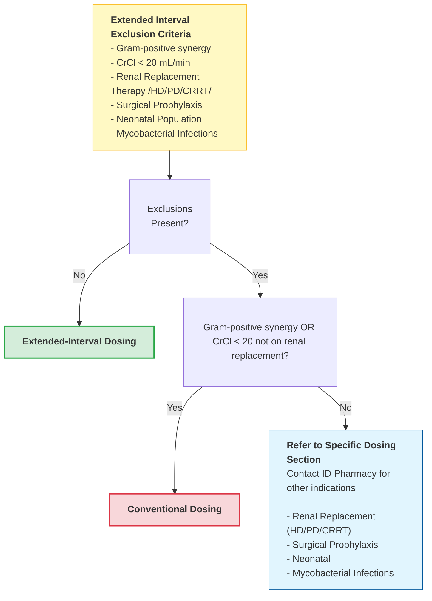

# Aminoglycoside Dosing Algorithm

```mermaid
flowchart TD
    %% Step 1: Initial Checklist
    Start["<b>Extended Interval Exclusion Criteria</b><br/>- Gram-positive synergy<br/>- CrCl < 20 mL/min<br/>- Renal Replacement Therapy /HD/PD/CRRT/<br/>- Surgical Prophylaxis<br/>- Neonatal Population<br/>- Mycobacterial Infections"] 
    
    Start --> B[Exclusions<br/>Present?]
    
    %% Path to EI
    B -- No --> EI["<b>Extended-Interval Dosing</b>"]

    %% Path to second decision
    B -- Yes --> C["Gram-positive synergy OR CrCl < 20 not on renal replacement?"]
    
    %% Final Outcomes
    C -- Yes --> Conv["<b>Conventional Dosing</b>"]
    
    C -- No --> D["<b>Refer to Specific Dosing Section</b><br/>Contact ID Pharmacy for other indications<br/><br/>- Renal Replacement (HD/PD/CRRT)<br/>- Surgical Prophylaxis<br/>- Neonatal<br/>- Mycobacterial Infections"]

    %% STYLING SECTION
    classDef wideBox min-width:400px,text-align:left;
    classDef outcomeBox min-width:300px,text-align:center;
    classDef diamond padding:20px;

    class Start,D wideBox;
    class EI,Conv outcomeBox;
    class B,C diamond;

    %% Individual Colors
    style Start fill:#fff9c4,stroke:#fbc02d
    style EI fill:#d4edda,stroke:#28a745,stroke-width:2px
    style Conv fill:#f8d7da,stroke:#dc3545,stroke-width:2px
    style D fill:#e1f5fe,stroke:#01579b
```
