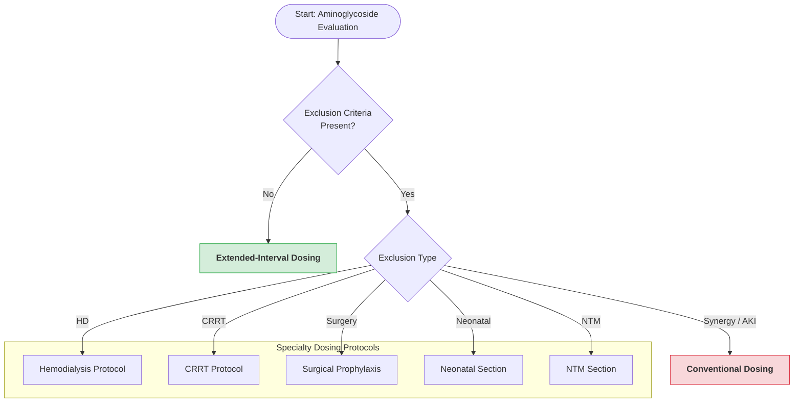

# Aminoglycoside Extended-Interval (EI) Dosing Algorithm

---

## 1. Eligibility for Extended-Interval (EI) Dosing

Patients are eligible for EI dosing unless any exclusion criteria below are present.

---

## 2. Exclusion Criteria for EI Dosing

- Gram-positive synergy indication (e.g., endocarditis)
- Renal insufficiency requiring conventional dosing consideration
- Hemodialysis (HD)
- Continuous renal replacement therapy (CRRT)
- Acute kidney injury with unstable renal function
- Surgical prophylaxis
- Pregnancy or neonatal population
- Nontuberculous mycobacterial (NTM) infection

---

## 3. Dosing Pathways

- **Gram-positive synergy (e.g., endocarditis)** → Conventional dosing
- **Renal insufficiency / AKI** → Conventional dosing
- **Hemodialysis (HD)** → Refer to HD dosing protocol
- **CRRT** → Refer to CRRT dosing protocol
- **Surgical prophylaxis** → Refer to surgical prophylaxis guideline
- **Neonatal population** → Refer to neonatal dosing section
- **NTM infections** → Refer to NTM dosing section

---

## 4. Flowchart

